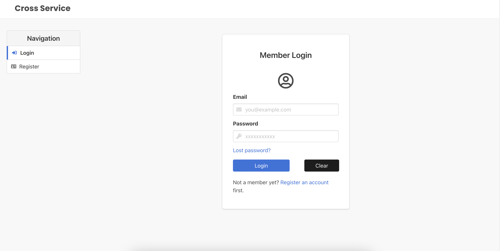
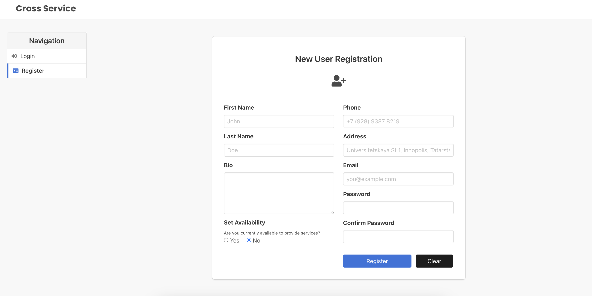
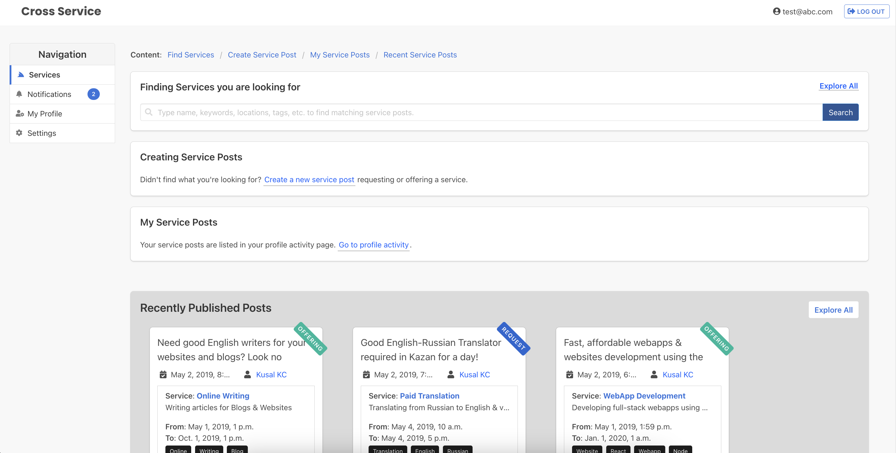
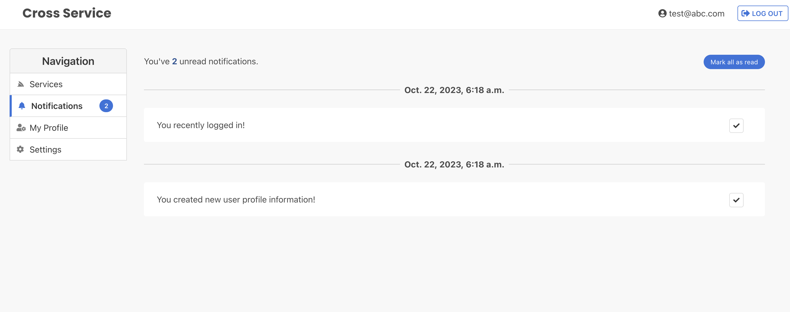
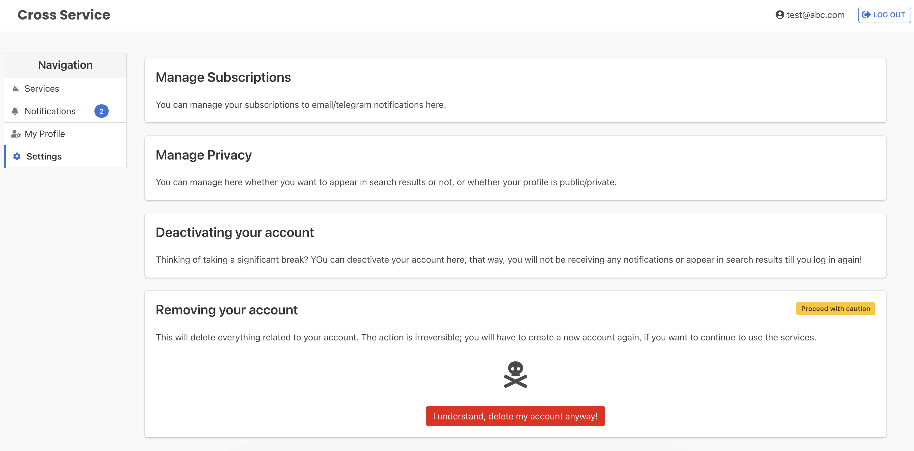
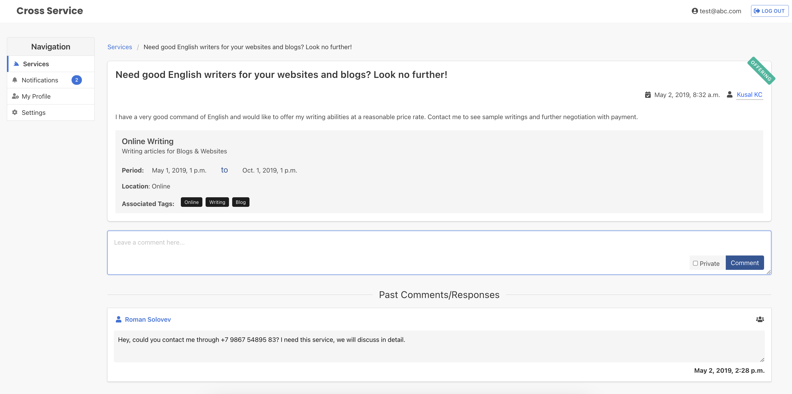

# What is "Cross Service"?
It is an online platform where anyone can join and offer their services to potential customers requiring those services. The goal is to connect these two types of users and let them sort the rest out.

# Demo
For the time being, a demo has been published and hosted at [https://crossservice-final--kckusal.repl.co](https://crossservice-final--kckusal.repl.co). You can register as a new user and start using the service immediately.

## Screenshots

# Launching the application locally
1. Install latest version of django framework

    `pip3 install django`

2. Navigate ( `cd ` ) to project directory and run following commands:

    - Configure admin credentials: You can do it manually through console, but for simplicity in this project, you can follow the following:

        -- Open file /main/migrations/`__createsuperuser__.py`.

        -- Set admin credentials in line 13-15 in this file.
         

    - Make and run migrations to configure db from defined models:

        `python3 manage.py makemigrations`

        `python3 manage.py makemigrations crosservice`

        `python3 manage.py migrate`
         
    - Run server:

        `python3 manage.py runserver`

        **Note**: Depending on your python installation, you can try just `py` istead of `python3` in commands above.
         

3. By default, it will open on `localhost:8000` or follow the server details shown in console.
 

# Acknowledgements
This so-called "cross service" project was developed as part of the Software Project Spring 2019 undergraduate course taught at Innopolis University, Russia.

Special appreciations to my group partners Roman Solovev, Syed Zuhair Abbas, and Amadey Kuspakov for their invaluable contributions in this project.